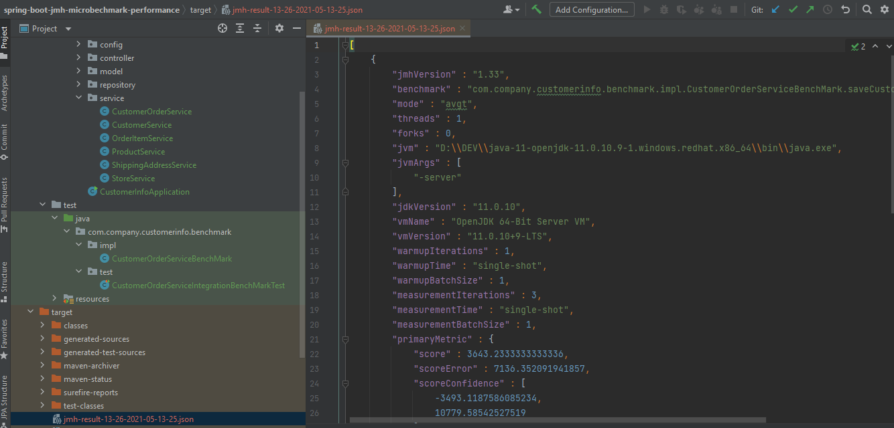

## spring-boot-jmh-microbechmark-performance

Purpose : Benchmark spring boot service layer methods by using jhm Java Microbenchmark Harness.  
Result : Get detailed performance information about execution time of a spring service component method.  

Steps to follow for creating jmh Java Microbenchmark Harness inside a spring boot junit test method.  

1- Add jmh artifacts into your pom.xml file.  
2- Create a new benchmark class for your service layer spring component inside test directory.  
3- Add target spring service component and spring context into benchmark class.  
4- Initialize spring context and get target service component.  
5- Refer to your benchmark class from JUnit test method.  
4- Run Junit method with @Test annotation to start benchmarking.  
 
### Local run steps  
1- To execute jmh run the following maven command :  
NOT : Execute maven command from where the pom.xml is located in the project directory.  
<pre> 
$ mvn clean install  
</pre>

Result "com.company.customerinfo.benchmark.impl.CustomerOrderServiceBenchMark.saveCustomerWithOrdersBenchMark":  
       4097.767 ±(99.9%) 25662.331 us/op [Average]  
       (min, avg, max) = (2805.100, 4097.767, 5595.800), stdev = 1406.639  
       CI (99.9%): [≈ 0, 29760.098] (assumes normal distribution)  

Run complete. Total time: 00:00:12  

REMEMBER: The numbers below are just data. To gain reusable insights, you need to follow up on  
why the numbers are the way they are. Use profilers (see -prof, -lprof), design factorial  
experiments, perform baseline and negative tests that provide experimental control, make sure  
the benchmarking environment is safe on JVM/OS/HW level, ask for reviews from the domain experts.  
Do not assume the numbers tell you what you want them to tell.  

Benchmark&emsp;&emsp;&emsp;&emsp;&emsp;&emsp;&emsp;&emsp;&emsp;&emsp;&emsp;&emsp;&emsp;&emsp;&emsp;&emsp;&emsp;&emsp;&emsp;&emsp;&emsp;&emsp;&emsp;&emsp;&emsp;&emsp;&emsp;  Mode Cnt Score Error Units  
CustomerOrderServiceBenchMark.saveCustomerWithOrdersBenchMark  avgt    3  4097.767 ± 25662.331  us/op  

Benchmark result is saved to target/jmh-result-04-26-2021-05-04-06.json  

  

### Tech Stack
Java 11  
H2 Database Engine  
spring boot  
spring boot starter data jpa  
spring boot starter web  
spring boot starter test  
hibernate  
logback  
maven  
jmh-Java Microbenchmark Harness  
springfox-swagger-ui  
datasource-proxy  
Docker  
 

### Docker build run steps
NOT : Execute docker commands from where the DockerFile is located.  
<pre>
$ docker system prune  
$ docker build . --tag demo   
$ docker run -p 8080:8080 -e "SPRING_PROFILES_ACTIVE=dev" demo:latest  
</pre>

## API OPERATIONS
### Save store with products successfully to database

Method : HTTP.POST  
URL : http://localhost:8080/customer-info/store/save  

Request : 
<pre>
curl --location --request POST 'http://localhost:8080/customer-info/store/save' \
--header 'Content-Type: application/json' \
--data-raw '{
  "name": "jeans_store",
  "products": [
    {
      "name": "prod1"
    },
    {
      "name": "prod2"
    },
    {
      "name": "prod3"
    }
  ]
}'
</pre> 

Response : 

HTTP response code 200  
<pre>
{
    "id": 1,
    "name": "jeans_store",
    "products": [
        {
            "id": 1,
            "name": "prod3"
        },
        {
            "id": 2,
            "name": "prod1"
        },
        {
            "id": 3,
            "name": "prod2"
        }
    ]
}
</pre>

### List Store saved to database

Method : HTTP.GET  
URL : http://localhost:8080/customer-info/store/list  

Request : 
<pre>
curl --location --request GET 'http://localhost:8080/customer-info/store/list'
</pre> 

Response : 

HTTP response code 200  
<pre>
[
    {
        "id": 1,
        "name": "jeans_store",
        "products": [
            {
                "id": 1,
                "name": "prod3"
            },
            {
                "id": 2,
                "name": "prod1"
            },
            {
                "id": 3,
                "name": "prod2"
            }
        ]
    }
]
</pre> 
